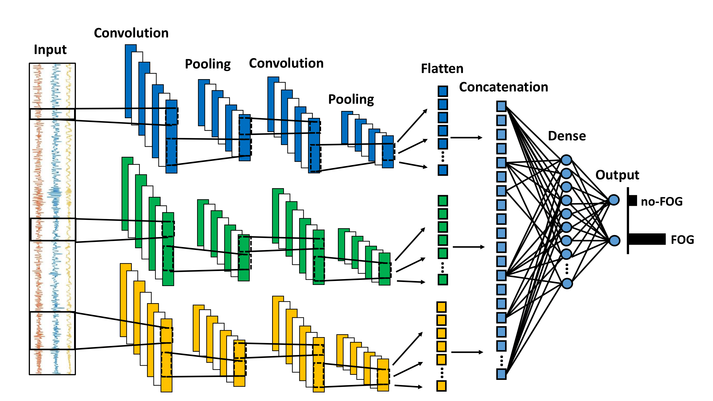

# Freezing of Gait Detection and Prediction Toolkit

Explore a comprehensive collection of scripts and datasets dedicated to the detection and prediction of Freezing of Gait (FoG) in Parkinson's Disease. Leveraging wearable sensors and machine learning techniques, this repository provides a robust toolkit for researchers and practitioners in the field.

## Train and Evaluate Script

The script "train_and_evaluate.py" trains and tests a multi-head convolutional neural network developed for freezing of gait detection from inertial data. 
The model is schematically represented in the figure below.

It consists of a three-headed CNN block connected to dense classification layers. Each head consists of two convolutional layers and two max-pooling layers. Each of these heads simultaneously processes the input using kernels of different sizes. The input has size 80 timesteps × 3 channels, where 80 correponds to the windows size (2-second window, sampling frequency = 40 Hz) and 3 is the number of components of the 3-axis accelerometer. The outputs of the CNN heads are flattened and concatenated to compose a vector feeding a single dense layer (16 units and a dropout rate of 0.5) and a final output layer with two outputs corresponding to the probability of FoG or no-FoG, respectively. The convolutional layers have 16 filters and ReLU activations each, with different kernel sizes in each head. Specifically, kernel sizes of 6 and 3 were selected in the two convolutional layers of the first head, 12 and 6 in the second head, and 18 and 9 in the third head. The stride was set to 1 in all convolutional layers without padding to gradually reduce the size of the input signal. In addition, a pool size of 3 and a dropout rate of 0.5 were used for all
convolutional layers, and the regularization term was set to 0.1 in the softmax layer. 

### Input

The script takes two CSV files as input:

- `train_data.csv` for training data
- `test_data.csv` for testing data

These files should contain a table with N samples and 4 columns. The 4 columns contain acceleration data (`accX`, `accY`, `accZ`) and the Freezing of Gait label (`fogLabel`). The number of samples depend on the amount of data, that should be sampled or resampled at 40 Hz.

#### Example Data Format

Here's an example of the expected format for the CSV files:

| accX   | accY   | accZ   | fogLabel |
|--------|--------|--------|----------|
| -0.123 |  0.456 |  0.789 |        0 |
| -0.987 |  0.654 |  0.321 |        1 |
|  0.111 | -0.222 |  0.333 |        0 |
|   ...  |   ...  |   ...  |      ... |

### Output

The script outputs the test label and prediction, writing to two CSV files:

- `test_label.csv`
- `test_prediction.csv`

The test label is extracted from the `test_data.csv` file. The prediction is obtained from the trained model and is in the form of probability (from 0 to 1). Test label and prediction can then be used for computing classification metrics. When evaluating test performance, remember that test data and label are here segmented with a 75% overlap.

### Important Information

1. Make sure your data is sampled or resampled to 40 Hz.
2. Adjust the learning rate, number of epochs, and batch size based on your dataset size. Specifically, as your dataset size increases, reduce the learning rate and increase the number of epochs and batch size. This configuration should work well with 30 minutes to 2 hours of data.
3. While the window size should be fixed at 2 seconds, you can adjust the overlap as you prefer. As the overlap increases, more windows are generated, producing more training data, which is beneficial. However, too large overlap may lead to overfitting. Thus, find the best compromise.
4. This model has shown good performance on acceleration data recorded from the waist/lower back. Evaluations on data recorded from other body locations have not been performed yet.

## Citation

Please cite the following paper in your publications if this repository helps your research.

Luigi Borzì, Luis Sigcha, Daniel Rodríguez-Martín, Gabriella Olmo, Real-time detection of freezing of gait in Parkinson’s disease using multi-head convolutional neural networks and a single inertial sensor, Artificial Intelligence in Medicine 135:102459 (2023). [DOI: 10.1016/j.artmed.2022.102459](https://doi.org/10.1016/j.artmed.2022.102459).

## Contact

For any questions or inquiries, feel free to contact:

- Luigi Borzì: [luigi.borzi@email.com](mailto:luigi.borzi@polito.it)
